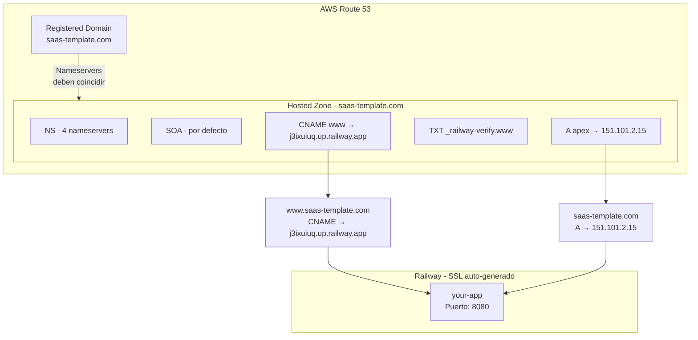

# Dominio Custom: AWS Route 53 + Railway

Guia para conectar un dominio registrado en AWS Route 53 con Railway como hosting.

> **Ultima actualizacion:** 2026-03-03
> **Dominio:** saas-template.com
> **Registrar:** AWS Route 53
> **Hosting:** Railway

---

## Arquitectura DNS



---

## Prerequisitos

- Dominio registrado en AWS Route 53
- Proyecto desplegado en Railway
- AWS CLI instalado y configurado

### Instalar AWS CLI (macOS)

```bash
brew install awscli
```

### Configurar credenciales

```bash
aws configure
# AWS Access Key ID: <tu-key>
# AWS Secret Access Key: <tu-secret>
# Default region: us-east-1
# Default output format: json
```

> **SEGURIDAD:** Nunca compartir access keys en chat, repos o files sin encriptar.
> Generar keys en: AWS Console → IAM → Users → Security credentials → Create access key.
> Agregar `*accessKeys*` a `.gitignore`.

---

## Step 1: Agregar Custom Domains en Railway

1. Railway Dashboard → tu service → **Settings → Networking → Custom Domain**
2. Agregar `www.saas-template.com` — Railway proporciona:
   - Un **CNAME target** (ej: `j3ixuiuq.up.railway.app`)
   - Un **TXT de verificacion** (ej: `_railway-verify.www` → `railway-verify=...`)
3. Agregar `saas-template.com` — Railway proporciona:
   - Un **CNAME target** para el apex (ej: `hcwvwque.up.railway.app`)
4. Copiar todos los valores para usarlos en Route 53

> **NOTA:** Railway puede asignar CNAME targets diferentes para `www` y el apex.

---

## Step 2: Crear Hosted Zone (si no existe)

Check hosted zones existentes:

```bash
aws route53 list-hosted-zones
```

Si no existe una para tu dominio, crearla desde la consola de AWS:
Route 53 → Hosted zones → Create hosted zone → `saas-template.com`

---

## Step 3: Crear records CNAME y TXT para www

Crear el CNAME que apunta `www.saas-template.com` a Railway y el TXT de verificacion.
Se pueden crear ambos en un solo command:

```bash
aws route53 change-resource-record-sets \
  --hosted-zone-id <TU_HOSTED_ZONE_ID> \
  --change-batch '{
    "Changes": [
      {
        "Action": "UPSERT",
        "ResourceRecordSet": {
          "Name": "www.saas-template.com",
          "Type": "CNAME",
          "TTL": 300,
          "ResourceRecords": [{"Value": "<CNAME_TARGET_DE_RAILWAY>"}]
        }
      },
      {
        "Action": "UPSERT",
        "ResourceRecordSet": {
          "Name": "_railway-verify.www.saas-template.com",
          "Type": "TXT",
          "TTL": 300,
          "ResourceRecords": [{"Value": "\"<TXT_VERIFICACION_DE_RAILWAY>\""}]
        }
      }
    ]
  }'
```

> **NOTA:** El valor del TXT debe ir entre comillas escapadas `\"...\"`

---

## Step 4: Crear record A para el apex

Route 53 **no permite CNAME en el dominio raiz** (apex). Para que `saas-template.com`
funcione, se crea un record **A** con la IP del CNAME target de Railway.

### Obtener la IP del target de Railway

```bash
dig <CNAME_TARGET_APEX_DE_RAILWAY> A +short
# Example: dig hcwvwque.up.railway.app A +short → 151.101.2.15
```

### Crear el record A

```bash
aws route53 change-resource-record-sets \
  --hosted-zone-id <TU_HOSTED_ZONE_ID> \
  --change-batch '{
    "Changes": [{
      "Action": "UPSERT",
      "ResourceRecordSet": {
        "Name": "saas-template.com",
        "Type": "A",
        "TTL": 300,
        "ResourceRecords": [{"Value": "<IP_OBTENIDA>"}]
      }
    }]
  }'
```

> **IMPORTANTE:** El record A usa una IP fija que Railway podria cambiar.
> Si el apex deja de funcionar, ejecutar `dig <cname-target> A +short`
> para obtener la IP actualizada y modificar el record.

---

## Step 5: Sincronizar Nameservers

Este es el paso mas critico. Los nameservers del **Registered Domain** deben coincidir
con los de la **Hosted Zone**. Si no coinciden, el DNS no resuelve (SERVFAIL).

### Obtener NS de la Hosted Zone

```bash
aws route53 list-resource-record-sets \
  --hosted-zone-id <TU_HOSTED_ZONE_ID> \
  --query "ResourceRecordSets[?Type=='NS'].ResourceRecords[].Value" \
  --output text
```

### Obtener NS del Registered Domain

```bash
aws route53domains get-domain-detail \
  --domain-name saas-template.com \
  --query 'Nameservers[].Name'
```

### Actualizar NS del dominio (si son diferentes)

```bash
aws route53domains update-domain-nameservers \
  --domain-name saas-template.com \
  --nameservers \
    Name=ns-1470.awsdns-55.org \
    Name=ns-384.awsdns-48.com \
    Name=ns-654.awsdns-17.net \
    Name=ns-1955.awsdns-52.co.uk
```

### Check que se aplicaron

```bash
aws route53domains get-domain-detail \
  --domain-name saas-template.com \
  --query 'Nameservers[].Name'
```

---

## Step 6: Check propagacion DNS

La propagacion puede tardar entre 5 minutos y 48 horas (normalmente < 1 hora).

### Consulta directa al nameserver (funciona inmediatamente)

```bash
dig www.saas-template.com CNAME @ns-384.awsdns-48.com
```

### Consulta via Google DNS

```bash
dig www.saas-template.com CNAME @8.8.8.8
```

### Consulta global (depende de propagacion)

```bash
dig www.saas-template.com CNAME
dig saas-template.com A
```

El resultado exitoso muestra status **NOERROR** y los records apuntando a Railway:

```
;; ANSWER SECTION:
www.saas-template.com.  300  IN  CNAME  j3ixuiuq.up.railway.app.
```

```
;; ANSWER SECTION:
saas-template.com.  300  IN  A  151.101.2.15
```

### Check response HTTP

```bash
# Con SSL
curl -sI https://www.saas-template.com/
curl -sI https://saas-template.com/

# Sin validar SSL (mientras Railway genera el certificado)
curl -sI https://www.saas-template.com/ -k
curl -sI https://saas-template.com/ -k
```

### Limpiar cache DNS local (macOS)

Si el DNS local no resuelve pero Google DNS (`@8.8.8.8`) si:

```bash
sudo dscacheutil -flushcache && sudo killall -HUP mDNSResponder
```

---

## Commands utiles de referencia

### Listar todos los records de una hosted zone

```bash
aws route53 list-resource-record-sets \
  --hosted-zone-id <TU_HOSTED_ZONE_ID>
```

### Listar todas las hosted zones

```bash
aws route53 list-hosted-zones
```

### Ver detalle del dominio registrado

```bash
aws route53domains get-domain-detail \
  --domain-name saas-template.com
```

### Eliminar un record

```bash
aws route53 change-resource-record-sets \
  --hosted-zone-id <TU_HOSTED_ZONE_ID> \
  --change-batch '{
    "Changes": [{
      "Action": "DELETE",
      "ResourceRecordSet": {
        "Name": "www.saas-template.com",
        "Type": "CNAME",
        "TTL": 300,
        "ResourceRecords": [{"Value": "hcwvwque.up.railway.app"}]
      }
    }]
  }'
```

> **NOTA:** Para eliminar un record, el JSON debe coincidir exactamente con el record existente.

### Eliminar una Hosted Zone

Primero eliminar todos los records custom (no se pueden eliminar NS ni SOA):

```bash
# Listar records
aws route53 list-resource-record-sets --hosted-zone-id <ID>

# Eliminar records custom (CNAME, A, etc.)
# ... usar DELETE como arriba

# Eliminar la hosted zone
aws route53 delete-hosted-zone --id <ID>
```

> Si quedan records custom, AWS dara error:
> "The specified hosted zone contains non-required resource record sets and so cannot be deleted."

---

## Troubleshooting

### SERVFAIL en dig

**Causa:** Nameservers del Registered Domain no coinciden con los de la Hosted Zone.
**Solucion:** Sincronizar nameservers (Step 5).

### 404 en Railway

**Causa:** El custom domain no esta agregado en Railway o no esta verificado.
**Solucion:** Agregar el dominio en Railway → Settings → Custom Domain. Esperar "DNS Verified".

### SSL error (curl exit code 60)

**Causa:** Railway aun no ha generado el certificado SSL.
**Solucion:** Esperar unos minutos. Railway genera SSL automaticamente al check el DNS.

### "Target was not found" al crear record A alias

**Causa:** Se intento crear el alias al apex antes de que exista el record CNAME de www.
**Solucion:** Crear primero el CNAME de `www`, luego el A alias.

### Hosted Zone no se puede eliminar

**Causa:** Tiene records custom (CNAME, A, etc.) ademas de NS y SOA.
**Solucion:** Eliminar todos los records custom primero, luego eliminar la Hosted Zone.

### SSL no se genera para el apex (saas-template.com)

**Causa:** Railway pide un CNAME para el apex, pero Route 53 no permite CNAME en el
dominio raiz. Se usa un record A con la IP, pero Railway no puede check eso como CNAME.

**Opciones:**

1. **Redirect apex → www (recommended):** Eliminar `saas-template.com` de Railway y
   configurar un redirect del apex al `www` a nivel DNS/servidor. Usar
   `www.saas-template.com` como dominio principal.

2. **Esperar:** Algunos users reportan que Railway eventualmente verifica el apex
   con el record A, pero puede tardar mas.

**Limitacion adicional:** Si Railway muestra el mensaje
*"You have hit the custom domain limit for your plan"*, el plan actual tiene un limite
de custom domains que podria estar bloqueando la verificacion del apex.
Subir de plan en Railway para agregar mas dominios.

---

## Configuracion actual (saas-template.com)

```
Hosted Zone ID: Z0307549LFJWSX75OIWB

Records:
  NS    saas-template.com              → ns-1470.awsdns-55.org, ns-384.awsdns-48.com,
                                          ns-654.awsdns-17.net, ns-1955.awsdns-52.co.uk
  SOA   saas-template.com              → (por defecto)
  CNAME www.saas-template.com          → j3ixuiuq.up.railway.app
  TXT   _railway-verify.www            → railway-verify=4a6f010664f52ea1064007cf99faadedda01c3cad0a9c542700c442259828dad
  A     saas-template.com              → 151.101.2.15 (IP de hcwvwque.up.railway.app)

Estado:
  www.saas-template.com   → HTTPS 200 OK, SSL valido, funcionando
  saas-template.com       → HTTPS 200 OK, SSL valido, funcionando
```

> **NOTA:** El record A del apex usa una IP fija. Si Railway cambia la IP, actualizar con:
> `dig hcwvwque.up.railway.app A +short` para obtener la nueva IP y modificar el record A.

---

*Verificado: 2026-03-03*
