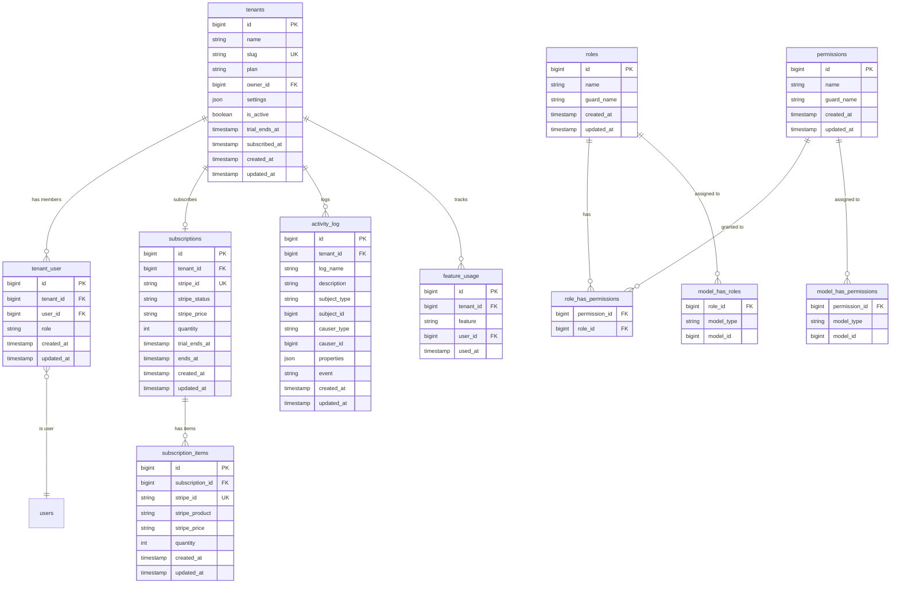
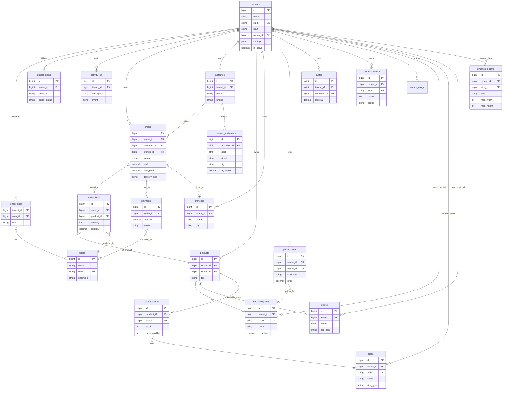

# Database SaaS Schema: SaaS Template

> Schema actual, normalizacion pendiente, tables nuevas, y plan de migracion.

---

## 1. Diagrama ER — Estado Actual del MVP

```mermaid
erDiagram
    users {
        bigint id PK
        string name
        string email UK
        string password
        timestamp email_verified_at
    }

    customers {
        bigint id PK
        string name
        string phone UK
        string email
        string password
        boolean notifications_messaging
        boolean notifications_payment
        boolean notifications_promos
    }

    customer_addresses {
        bigint id PK
        bigint customer_id FK
        string label
        string street
        string district
        string city
        string state
        string zip
        text references
        boolean is_default
    }

    branches {
        bigint id PK
        string name
        text address
        string city
        string state
        string phone
        string schedule
        decimal lat
        decimal lng
        string maps_url
        boolean is_active
    }

    item_categories {
        bigint id PK
        string code UK
        string name
        text description
        int display_order
        boolean is_active
    }

    sizes {
        bigint id PK
        string code UK
        string name
        string size_type
        int display_order
        boolean is_active
    }

    colors {
        bigint id PK
        string name UK
        string hex_code
        int display_order
        boolean is_active
    }

    products {
        bigint id PK
        bigint model_id FK
        bigint color_id FK
        string title
        text description
        string technique
        string material
        json sizes "LEGACY"
        json colors "LEGACY"
        json tags
        json photos
        boolean is_active
    }

    product_sizes {
        bigint id PK
        bigint product_id FK
        bigint size_id FK
        int stock
        int price_modifier
        boolean is_active
    }

    pricing_rules {
        bigint id PK
        bigint model_id FK
        string model "LEGACY"
        string size_type
        int min_qty
        int max_qty
        decimal price
        string label
        string savings
        boolean is_active
    }

    dimension_limits {
        bigint id PK
        string size "STRING no FK"
        string side
        int max_width
        int max_height
        string label
        boolean is_active
    }

    orders {
        bigint id PK
        bigint customer_id FK
        string customer_name "DENORM"
        string customer_phone "DENORM"
        string customer_email "DENORM"
        bigint branch_id FK
        string delivery_type
        json items "LEGACY"
        decimal subtotal
        decimal total
        decimal total_paid
        string status
        text notes
        json attachments
        string shipping_address
        string shipping_district
        string shipping_city
        string shipping_state
        string shipping_zip
        decimal shipping_lat
        decimal shipping_lng
        string shipping_map_url
        string shipping_carrier
        string shipping_service
        decimal shipping_cost
        string shipping_delivery_estimate
        string tracking_number
        string shipping_label_url
        string tracking_url
        timestamp shipped_at
        string payment_gateway_order_id
        string payment_link_url
        string payment_link_expires_at
        timestamp confirmed_at
        timestamp in_production_at
        timestamp ready_at
        timestamp delivered_at
        timestamp paid_at
        timestamp estimated_delivery
    }

    order_lines {
        bigint id PK
        bigint order_id FK
        bigint product_id FK
        string size
        string color
        int quantity
        decimal unit_price
        decimal subtotal
        json customization
        string design_image
        text design_notes
        timestamp produced_at
        bigint produced_by FK
    }

    payments {
        bigint id PK
        bigint order_id FK
        decimal amount
        string method
        string reference
        string payment_gateway_charge_id
        string payment_type
        text notes
        timestamp received_at
        bigint received_by FK
    }

    quotes {
        bigint id PK
        string customer_name "NO FK"
        string customer_phone "NO FK"
        string model
        string size
        int quantity
        decimal unit_price
        decimal subtotal
        decimal deposit
        json design_specs
        timestamp expires_at
    }

    business_configs {
        bigint id PK
        string key UK
        text value
        string type
        string group
        text description
        boolean is_active
    }

    customers ||--o{ customer_addresses : "has many"
    customers ||--o{ orders : "has many"
    orders ||--o{ order_lines : "has many"
    orders ||--o{ payments : "has many"
    orders }o--|| branches : "pickup at"
    order_lines }o--|| products : "of product"
    products }o--|| item_categories : "type"
    products }o--|| colors : "color"
    products ||--o{ product_sizes : "available in"
    product_sizes }o--|| sizes : "size"
    pricing_rules }o--|| item_categories : "for model"
    payments }o--o| users : "received by"
    order_lines }o--o| users : "produced by"
```



---

## 2. Problemas de Normalizacion Actuales

### 2.1 Campos Legacy (a eliminar)

Estos campos existen por compatibilidad con la migracion desde NestJS. Ya tienen reemplazo normalizado.

| Table | Campo Legacy | Reemplazo Normalizado | Accion |
|-------|-------------|----------------------|--------|
| `orders` | `items` (JSON) | `order_lines` (table) | **Eliminar** — todos los orders ya usan order_lines |
| `items` | `sizes` (JSON) | `product_sizes` (pivot) | **Eliminar** — item usa pivot |
| `items` | `colors` (JSON) | `color_id` (FK) | **Eliminar** — item tiene FK |
| `pricing_rules` | `model` (string) | `model_id` (FK) | **Eliminar** — regla tiene FK |

**Migracion requerida:**
```
1. Check que ningun codigo use el campo legacy (grep en codebase)
2. Crear migracion que elimina columns
3. Actualizar model: quitar de $fillable y $casts
```

### 2.2 Campos Denormalizados (mantener con intencion)

Estos campos duplican datos de la relacion. Se mantienen a proposito como "snapshot" del momento del order (si el customer cambia su name despues, el order conserva el name original).

| Table | Campos | Relacion | Decision |
|-------|--------|----------|----------|
| `orders` | `customer_name`, `customer_phone`, `customer_email` | `customer_id` → customers | **MANTENER** — snapshot valido. Util si el customer se elimina/anonimiza. |
| `order_lines` | `size`, `color` | Podrian ser FKs a sizes/colors | **MANTENER** — snapshot del item al momento del order. Si se renombra un color, el order conserva el original. |

### 2.3 FKs Faltantes (a agregar)

| Table | Campo | Deberia ser FK a | Problema actual |
|-------|-------|-----------------|-----------------|
| removed | `size` (string) | `sizes.code` | Es string suelto, no valida contra table sizes |
| `quotes` | `customer_name`, `customer_phone` | `customers` via `customer_id` FK | No tiene relacion con customers. Cotizacion queda huerfana. |
| `quotes` | `model` (string) | `item_categories.code` | String suelto, no FK |

**Recomendacion para SaaS:**
- `dimension_limits.size` → agregar `size_id` FK (y deprecar string)
- `quotes` → agregar `customer_id` FK (nullable, porque se puede cotizar sin registration)
- `quotes.model` → agregar `model_id` FK (consistente con pricing_rules)

### 2.4 Table orders Demasiado Ancha

`orders` tiene **40+ columns**, incluyendo 13 campos de shipping y 3 de Payment Gateway. Para SaaS con mas features, esto crece peor.

**Opcion A — No tocar (pragmatico):**
- Funciona, no rompe nada
- Una sola query trae todo
- Para MVP SaaS es aceptable

**Opcion B — Extraer a tables separadas (si se justifica):**

| Grupo de campos | Table nueva | Cuando extraer |
|----------------|------------|---------------|
| `shipping_*` (13 campos) + `tracking_*` + `shipped_at` | `shipments` | Cuando se soporte re-envio o multiples intentos de envio |
| `payment_gateway_order_id` + `payment_link_*` | `payment_links` | Cuando se soporte multiples links por order |

**Recomendacion:** Opcion A para Fase 1-2. Evaluar Opcion B solo si surge necesidad real.

---

## 3. Tables Nuevas para SaaS

### Diagrama ER — Capa SaaS



### Detalle de tables nuevas

#### `tenants`
```
Proposito: Representa una business/negocio.
Registrations esperados: 10 (Ano 0) → 100 (Ano 1) → 1000 (Ano 3)

Columns:
  id              bigint PK auto
  name            string(100)         -- "SaaS Template"
  slug            string(50) unique   -- "saas-template" (para URLs)
  plan            string(20)          -- "starter", "growth", "pro"
  owner_id        bigint FK→users     -- quien creo la cuenta
  settings        json                -- { logo, colors, currency, timezone, messaging, email, address }
  is_active       boolean default true -- para suspender cuentas morosas
  trial_ends_at   timestamp nullable  -- null si ya es pagado
  subscribed_at   timestamp nullable  -- null si es trial
  created_at      timestamp
  updated_at      timestamp

Indices: slug (unique), owner_id, is_active, plan
```

#### `tenant_user` (pivot)
```
Proposito: Un user puede pertenecer a N tenants con diferentes roles.
Example: Juan es Owner en "ImprXYZ" y Sales en "SaaS Cancun".

Columns:
  id              bigint PK auto
  tenant_id       bigint FK→tenants   cascade
  user_id         bigint FK→users     cascade
  role            string(30)          -- "owner", "admin", "sales", "operations", "finance"
  created_at      timestamp
  updated_at      timestamp

Indices: unique(tenant_id, user_id), user_id
```

#### `subscriptions` + `subscription_items` (Laravel Cashier)
```
Proposito: Gestion de suscripciones Stripe.
Creadas automaticamente por Laravel Cashier.
No disenar manualmente — Cashier crea las migrations.

Command: php artisan cashier:install
```

#### `activity_log` (Spatie)
```
Proposito: Audit trail de actions por tenant.
Creada automaticamente por spatie/laravel-activitylog.

Command: php artisan vendor:publish --provider="Spatie\Activitylog\ActivitylogServiceProvider" --tag="activitylog-migrations"

Personalizar: agregar tenant_id a la migracion generada.
```

#### `feature_usage` (tracking)
```
Proposito: Registrar uso de features por tenant (para adoption metrics y health score).
Referenciada en SAAS_METRICS.md seccion Feature Adoption.

Columns:
  id              bigint PK auto
  tenant_id       bigint FK→tenants
  feature         string(50)          -- "order_wizard", "production_board", "pdf_share", etc.
  used_at         timestamp
  user_id         bigint FK→users nullable

Indices: (tenant_id, feature, used_at), (tenant_id, used_at)
Retencion: 90 dias (job diario limpia registrations antiguos)
```

#### `roles`, `permissions`, pivots (Spatie Permission)
```
Proposito: RBAC para roles y permisos.
Creadas automaticamente por spatie/laravel-permission.

Command: php artisan vendor:publish --provider="Spatie\Permission\PermissionServiceProvider"
```

---

## 4. Diagrama ER Completo — SaaS Final



---

## 5. Plan de Migrations (Orden Exacto)

### Fase 1a — Limpieza Legacy (antes de tenant_id)

```
Migracion 1: drop_legacy_columns
  - orders:        DROP COLUMN items
  - products:      DROP COLUMN sizes, DROP COLUMN colors
  - pricing_rules: DROP COLUMN model

Prerequisito: grep en codebase para confirmar que no se usan.
Los campos legacy tienen fallbacks en los models que se deben limpiar.
```

### Fase 1b — Normalizacion menor

```
Migracion 2: normalize_quotes
  - quotes: ADD customer_id bigint FK→customers nullable
  - quotes: ADD model_id bigint FK→item_categories nullable

Migracion 3: normalize_dimension_limits
  - dimension_limits: ADD size_id bigint FK→sizes nullable
  - Actualizar registrations existentes: size string → size_id via lookup
```

### Fase 1c — Tables SaaS core

```
Migracion 4: create_tenants_table
  - Crear table tenants

Migracion 5: create_tenant_user_table
  - Crear table pivot tenant_user

Migracion 6: add_tenant_id_to_business_tables
  - ADD tenant_id bigint FK→tenants nullable a:
    orders, customers, products, pricing_rules, quotes,
    branches, business_configs, item_categories, colors, sizes,
    dimension_limits
  - Index en cada tenant_id

Migracion 7: seed_default_tenant
  - INSERT tenant "SaaS Template" (slug: saas-template, plan: pro)
  - UPDATE todas las tables SET tenant_id = 1
  - INSERT tenant_user (owner) para el admin actual
  - ALTER tenant_id SET NOT NULL en: orders, customers, products, pricing_rules,
    quotes, branches, business_configs
  - MANTENER tenant_id NULLABLE en: item_categories, sizes, colors, dimension_limits
    (NULL = template global, ver seccion 8 "Hibrido con herencia")

Migracion 8: spatie_permission_tables
  - php artisan vendor:publish (Spatie Permission)
  - Seeder: crear roles y permisos

Migracion 9: spatie_activity_log
  - php artisan vendor:publish (Spatie Activitylog)
  - Agregar tenant_id a activity_log

Migracion 10: cashier_tables (Fase 2)
  - php artisan cashier:install
  - Agregar tenant_id a subscriptions
```

### Indices Criticos

```sql
-- Cada table con tenant_id necesita:
CREATE INDEX idx_{table}_tenant ON {table} (tenant_id);

-- Indices compuestos para queries frecuentes:
CREATE INDEX idx_orders_tenant_status ON orders (tenant_id, status);
CREATE INDEX idx_orders_tenant_created ON orders (tenant_id, created_at DESC);
CREATE INDEX idx_customers_tenant_phone ON customers (tenant_id, phone);
CREATE INDEX idx_payments_tenant_received ON payments (order_id, received_at DESC);
-- (payments hereda tenant via order_id, no necesita tenant_id propio)
```

---

## 6. Tables que NO necesitan tenant_id

| Table | Razon |
|-------|-------|
| `users` | Global. Un user puede estar en N tenants via `tenant_user`. |
| `tenants` | ES la table de tenants. |
| `tenant_user` | Pivot, ya tiene tenant_id como FK. |
| `subscriptions` | Vinculada a tenant via Cashier `billable_id`. |
| `roles` | Globales (Owner, Admin, Sales, etc. son iguales para todos). |
| `permissions` | Globales (mismos permisos para todos los tenants). |
| `sessions` | Framework. |
| `cache` / `jobs` / `failed_jobs` | Framework. |
| `password_reset_tokens` | Framework. |

---

## 7. Tables que Heredan tenant_id (sin column propia)

Estas tables pertenecen a un tenant a traves de su relacion padre:

| Table | Hereda tenant via | Justificacion |
|-------|-------------------|---------------|
| `order_lines` | `order_id` → orders.tenant_id | Siempre se accede via order |
| `payments` | `order_id` → orders.tenant_id | Siempre se accede via order |
| `customer_addresses` | `customer_id` → customers.tenant_id | Siempre se accede via customer |
| `product_sizes` | `product_id` → products.tenant_id | Siempre se accede via product |

**Note:** No agregar tenant_id redundante a estas tables. El Global Scope del padre ya las filtra. Agregar solo si se necesitan queries directas sin join (optimizacion futura).

---

## 8. Consideraciones de tenant_id en Tables Catalogo

### Problema: Sizes, Colors, ItemCategorys — globales o por tenant?

**Opcion A — Globales (compartidos):**
- Sizes CH/MD/GD/EG/XX son las mismas para todas las businesss
- Colors basicos son los mismos
- Simplifica onboarding (no hay que recrear)

**Opcion B — Por tenant (cada business tiene los suyos):**
- Una business de gorras tiene tallas diferentes
- Colors varian por proveedor
- Permite personalizacion total

**Recomendacion: Hibrido con herencia**

```
Estrategia:
1. Existen "templates" globales (sin tenant_id) → tallas estandar, colors comunes
2. Cada tenant puede crear registrations propios (con tenant_id)
3. Query: WHERE tenant_id = {current} OR tenant_id IS NULL
4. Si el tenant crea una talla con el mismo code, override el global

Esto permite:
- Onboarding rapido (ya tiene tallas y colors sin configurar nada)
- Personalizacion para businesss especializadas
- Simplicidad: las businesss SaaS usan los defaults y nunca tocan esta config
```

---

## 9. Volumetria Esperada

| Table | Por Tenant (mensual) | 100 Tenants (Ano 1) | 1000 Tenants (Ano 3) |
|-------|:--------------------:|:-------------------:|:--------------------:|
| orders | 30-200 | 3K-20K | 30K-200K |
| order_lines | 60-600 | 6K-60K | 60K-600K |
| payments | 30-400 | 3K-40K | 30K-400K |
| customers | 20-100 | 2K-10K | 20K-100K |
| products | 5-50 (total, no mensual) | 500-5K | 5K-50K |
| quotes | 10-50 | 1K-5K | 10K-50K |
| activity_log | 100-500 | 10K-50K | 100K-500K |

**Conclusion:** PostgreSQL maneja esto sin problemas con indices en tenant_id. No se necesita sharding hasta >10K tenants.

---

*Documento creado: 2026-02-16*
*Ultima actualizacion: 2026-02-17*
